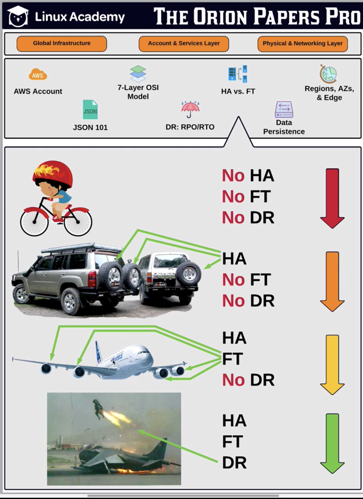

# High Availability, Fault Tolerance and Disaster Recovery

LA AWS Account - [Bookmark](https://linuxacademy.com/cp/courses/lesson/course/2851/lesson/3)

## HA 

Ability recover from a failure

> Example 4x4 with a spare wheel, using the spare wheel recover from failure.
> Auto scaling group in multiple AZ.

## Fault Tolerance

> Example plane with multiple engine.
> FT system needs to survive failures.
> Example RDS database to manage data integrity
> System works through failure.

## DR

Separate process outside of HA and FT. A different system protects critical system data and recreate the system.

# RPO and RTO

LA AWS Account - [Bookmark](https://linuxacademy.com/cp/courses/lesson/course/2851/lesson/4)

## RPO - Recovery Point Objective

* When disaster occurs and the last recoverable backup is.
* Amount of data lose.

## RTO - Recovery Time Objective

* Time from disaster occurs and time to recover the platform.
