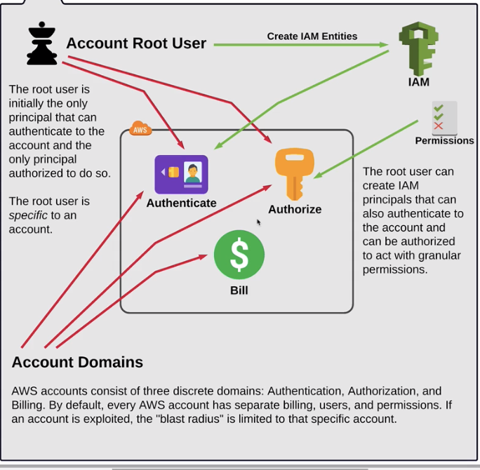

# Solutions Architect - Professional

* 170 mins
* Questions and Answers are longer and complex
* Reading and comprehension exams

## AWS Accounts

LA - (Bookmark)[https://linuxacademy.com/cp/courses/lesson/course/2851/lesson/1/module/245]

* Isolated piece 1) Authentication / Authorization and Billing.
* Root user is the only Principal that can authenticate to the account and only principal authorized to do so. 

